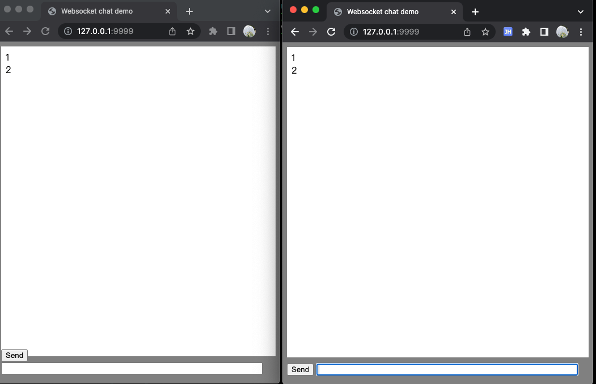

#### 基于 echo+websocket+html+js 实现的聊天demo

#### 案例来自于  <a href="https://github.com/gorilla/websocket" target="_blank">gorilla/websocket</a>


### 运行

```shell
go run main.go
```

### 打开浏览器

localhost:9999


### 效果



